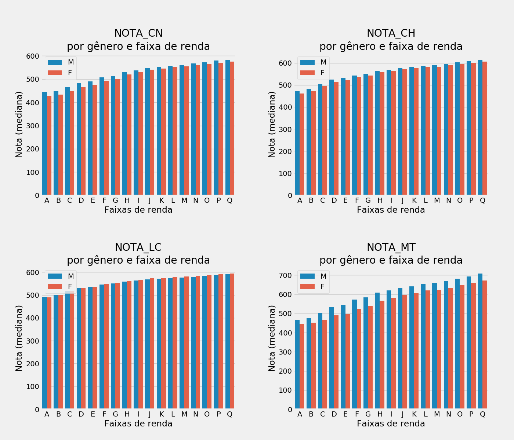
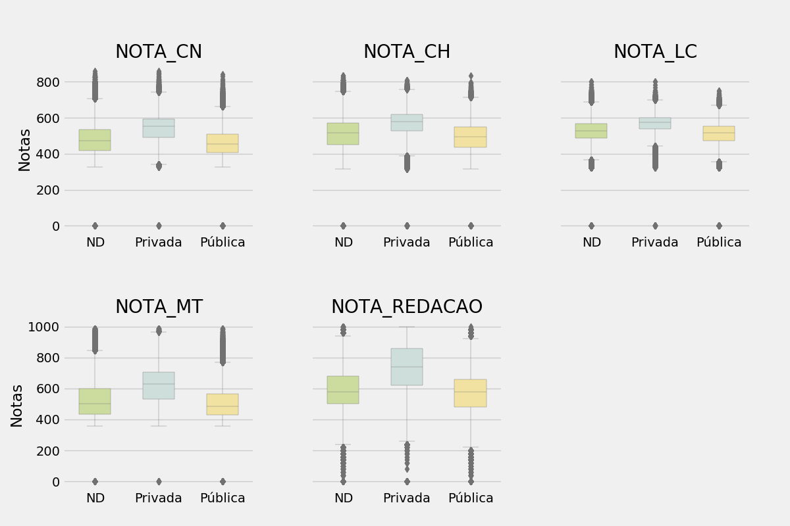

# Explorando os dados do ENEM 2019 usando o Python

Todo o conteúdo desta página foi baseado na exploração, visualziação e análise dos microdados referentes ao ENEM 2019. A versão completa dos dados pode ser encontrada na página do INEP (http://inep.gov.br/web/guest/microdados).

A tabela original, que ocupa cerca de 3 Gb em disco, conta com mais mais de 5 milhões de linhas e 137 colunas. Manipular todo esse volume de dados em computadores pessoais pode não ser uma tarefa fácil. Por isso, ao longo dessa jornada, trabalharemos com uma versão reduzida (em número de colunas), selecionando apenas aquelas colunas que considero relevantes para a produção deste conteúdo.

Iremos utilizar algumas das principais bibliotecas usadas em Data Science: Numpy, Pandas, Matplotlib, Seaborn, SciPy e SciKit-learn.

## Importando as bibliotecas relevantes

```python
import numpy as np
import matplotlib.pyplot as plt
import pandas as pd
import seaborn as sns
```

## Importando os dados
Usaremos o **Pandas** para importar os dados (em formato csv), checar o número de linhas e colunas e visualizar alguns registros.

```python
df = pd.read_csv("microdados_colunas_relevantes.csv")

df.shape

df.head()
```

## Visualizando os dados
Antes de começar a analisar os dados, é interessante explorá-los visualmente. **Matplotlib**, **Seaborn** e mesmo **Pandas** são bibliotecas que podem ser usadas para este fim. Independentemente da biblioteca escolhida, é possível notar que, em muitos casos, não haverá uma única forma de se fazer algo.

Por exemplo, podemos explorar a distribuição dos candidatos por estado:

* usando um **método** (`.plot.bar()`) da biblioteca Pandas.

```python
plt.figure(figsize = (10,6))
plt.title("Proporção dos candidatos por UF")
plt.ylabel("Frequência relativa")
df['SG_UF_RESIDENCIA'].value_counts(normalize = True).plot.bar(width = 0.5)
plt.savefig('figure1.png')
```


* usando a função `bar()` da biblioteca Matplotlib.

```python
candidatos_estado = df["SG_UF_RESIDENCIA"].value_counts(normalize = True)
plt.figure(figsize = (10,6))
plt.bar(candidatos_estado.index, candidatos_estado, width = 0.5)
plt.title("Proporção dos candidatos por UF")
plt.ylabel("Frequência relativa")
plt.savefig('figure2.png')
```


Vários aspectos dos gráficos podem ser modificados (tais como cor, largura e espaçamento entre as barras, etc.). Os parâmetros pertinentes, bem como a forma correta de uso podem ser conferidos nas *docstrings* de cada função. Para acessá-las, basta usar a função *help()*.

Podemos, por exemplo, usar o Seaborn para produzir gráficos de barras (horizontais), cujas cores foram definidas por nós mesmos.

```python
candidatos_genero = df["TP_SEXO"].value_counts(normalize = True)
plt.figure(figsize = (10,6))
plt.title("Distribuição dos candidatos por sexo (declarado)")
sns.barplot(y = candidatos_genero.index, x = candidatos_genero,
    palette = ["#FCD0BAff", "#F1828Dff"])
plt.xlabel("")
plt.savefig('figure3.png')
```

Neste caso, apresentamos a distribuição dos candidatos por gênero (declarado).


Para uma exibição mais concisa, é possível exibir todos os gráficos que tratam de um mesmo tema (dados socioeconômicos) em um único painel. Mas antes disso, precisamos fazer algumas modificações nos nossos dados para facilitar e melhorar a visualziação

```python
## renomeando os as raças conforme os dicionário de dados
racas = ["ND", "Branca", "Preta", "Parda", "Amarela", "Indígena"]
raca_codigo = dict(zip(range(6), racas))
candidatos_raca = df["TP_COR_RACA"].value_counts(normalize = True)
candidatos_raca.rename(index = raca_codigo, inplace = True)

## computador e internet
candidatos_pc_int = df[["Q024", "Q025"]]
filtro_computador = candidatos_pc_int["Q024"].isin(['B', 'C', 'D', 'E'])
## modificando os dados para visualização
candidatos_pc_int["Q024"].loc[filtro_computador] = "Sim"
candidatos_pc_int["Q024"].loc[~filtro_computador] = "Não"
candidatos_pc_int["Q025"].replace("A", "Não", inplace = True)
candidatos_pc_int["Q025"].replace("B", "Sim", inplace = True)
comp = candidatos_pc_int['Q024'].value_counts(normalize = True)
internet = candidatos_pc_int['Q025'].value_counts(normalize = True)
tmp_df = pd.DataFrame([comp, internet])
tmp_df = tmp_df.transpose()
sim = np.array(tmp_df.iloc[0,:])
nao = np.array(tmp_df.iloc[1,:])
labels = ['Computador', 'Internet']
```
Basicamente, criamos um subconjunto de dados em que foram substituímos os códigos numéricos pelos nomes das raças. Além disso tornamos binária (sim ou não) a resposta à questão "Q024" do questionário socioeconômico (que diz respeito ao número de computadores em casa).

Agora sim, com auxílio da função `GridSpec()` podemos plotar um 

```python
gs = plt.GridSpec(2,3)
fig = plt.figure(constrained_layout = True, figsize = (22, 15))

plt.subplots_adjust(hspace = 0.5, wspace = 0.3)
ax1 = fig.add_subplot(gs[0, :2])
sns.barplot(x = candidatos_estado.index, y = candidatos_estado)
plt.title("Proporção dos candidatos por UF")
plt.ylabel("Frequência relativa")

ax2 = fig.add_subplot(gs[0, 2])
df['Q006'].value_counts(normalize = True).sort_index().plot.bar(
    color ='#8FB9A886', legend = False, width = 0.8)
plt.title("Distribuição candidatos por faixa de renda\n(declarada)")

ax3 = fig.add_subplot(gs[1, 0])
plt.title("Distribuição dos candidatos\n por sexo (declarado)")
df['TP_SEXO'].value_counts(normalize = True).plot.barh(color = ["#4AB19DFF",
    "#765D69FF"])

ax4 = fig.add_subplot(gs[1, 1])
plt.title("Acesso a computador e internet\nem casa")
plt.bar(labels, sim, width, label = 'Sim', color = "#F18C8EFF")
plt.bar(labels, nao, width, label = 'Não',bottom=sim, color = "#F1D1B5FF")
plt.legend()

ax5 = fig.add_subplot(gs[1,2])
plt.title("Distribuição dos candidatos\npor raça (declarada)")
paleta = ["#8FB9A8FF", "#FCBB6DFF", "#FCD0BAFF", "#F1828DFF", "#765D69FF",
    "#510A32FF"]
sns.barplot(x = candidatos_raca.index, y = candidatos_raca, palette = paleta)
plt.ylabel("Frequência relativa")
plt.savefig('figure4.png')


```


Durante o desenvolvimento, é recomendável a criação de funções para tornar seu código mais conciso, inteligível e **reutilizável**. Além, claro, de evitar a desnecessária repetição de linhas de código. Aqui, no entanto, a repetição deliberada tem fins didáticos.

# Comparando notas
Antes de comparar as notas, vamos:
    * descartar todos os registros de pessoas que faltaram a pelo menos um dia de prova e também daquelas que foram eliminadas de ao menos uma prova.
    * descartar os registros que contenham dados faltantes (`NaN`) em pelo menos uma coluna.
    * renomear as colunas das notas (eliminando o prefixo *NU_*).

```python
df_presente_todas = df.query("TP_PRESENCA_CN % 2 != 0 & TP_PRESENCA_CH != 0 &\
    TP_PRESENCA_LC != 0 & TP_PRESENCA_MT != 0")

provas = ["NU_NOTA_CN", "NU_NOTA_CH", "NU_NOTA_LC", "NU_NOTA_MT",
    "NU_NOTA_REDACAO"]

df_presente_todas.dropna(how = 'any', subset = provas, inplace = True)

df_presente_todas.shape
#(3702007, 26)


nnames = [x.replace("NU_", "") for x in provas]
df_presente_todas.rename(columns = dict(zip(provas, nnames)), inplace = True)
provas = nnames
```

> Embora nós tenhamos eliminado os dados faltantes, existem diferentes maneiras de lidar com os eles. Dentre as alternativas (ao descarte dos registros com dados faltantes) estão as diferentes estratégias de imputação, havendo, inclusive, uma API específica para isso no Scikit-learn (**sklearn.impute**).

Após eliminados os dados faltantes e os registros de candidatos que faltaram ou foram eliminados de pelo menos uma prova, o nosso "novo" conjunto de dados ainda conta com > 3,7 milhões de registros. Podemos 

```python
plt.figure(figsize = (10,6))
plt.title("Dispersão das notas das provas\ndo ENEM 2019")
sns.boxplot(data = df_presente_todas[provas], linewidth = 0.3,
    palette = paleta[:4])
plt.ylabel("Notas")
plt.savefig('figure5.png')
```


Visualmente, vemos que as medianas das notas são diferentes, sendo a nota de redação a maior delas e nota na prova de Ciências Naturais, a menor delas. Percebemos ainda que as notas distribuem-se de maneira diferente. De modo mais exato, podemos verificar as estatísticas básicas usando o método `.describe()`.

```python
df_presente_todas[provas].describe()
#            NOTA_CN       NOTA_CH       NOTA_LC       NOTA_MT  NOTA_REDACAO
#count  3.702007e+06  3.702007e+06  3.702007e+06  3.702007e+06  3.702007e+06
#mean   4.778833e+02  5.098906e+02  5.223966e+02  5.231851e+02  5.797694e+02
#std    7.604584e+01  8.097881e+01  6.274888e+01  1.090252e+02  1.825116e+02
#min    0.000000e+00  0.000000e+00  0.000000e+00  0.000000e+00  0.000000e+00
#25%    4.178000e+02  4.508000e+02  4.855000e+02  4.352000e+02  5.000000e+02
#50%    4.703000e+02  5.134000e+02  5.278000e+02  5.011000e+02  5.800000e+02
#75%    5.332000e+02  5.686000e+02  5.666000e+02  5.979000e+02  6.800000e+02
#max    8.609000e+02  8.351000e+02  8.017000e+02  9.855000e+02  1.000000e+03
```

São significativas as diferenças entre as médias e medianas das notas das diferentes provas? Podemos usar o teste de Kruskal-Wallis (`kruskal` da biblioteca **Scipy**)para responder a essa pergunta. Sem entrar em muitos detalhes, não vamos usar ANOVA, pois nossos dados violam algumas das premissas do teste. Por exemplo, podemos constatar que os desvios (*std* no bloco acima) variam bastante entre si.
Como a função `kruskal` exige que os dados de entrada estejam armazenados *arrays* unidimensionais (na verdade, como passo intermediário, utilizaremos um *array* n-dimensional), usaremos a biblioteca **Numpy** para fazer as modificações necessárias.

```python
shp = df_presente_todas[provas].shape
tmp_array = df_presente_todas[provas].values.reshape(1, shp[0], shp[1])
cn, ch, lc, mt, re = [tmp_array[:, :, i].flatten() for i in range(len(provas))]
```

Podemos confirmar que nossos *arrays* contêm, de fato, as notas de cada prova

```python
notas = [cn, ch, lc, mt, re]
[(x == df_presente_todas[y].values).all() for x,y in zip(notas,provas)]
#[True, True, True, True, True]
```

Uma vez obtidos os *arrays* com as notas de cada prova, podemos conduzir o teste de Kruskal-Wallis.

```python
from scipy import stats
stats.kruskal(cn, ch, lc, mt, re)
#KruskalResult(statistic=1698960.474576954, pvalue=0.0)
```

O resultado do teste nos indica que há pelo menos duas notas (cujas distribuições) diferem entre si. Contudo não podemos (embora possamos sugerir) determinar quais pares de notas são significativamente diferentes. Podemos, conforme sugerido na *docstring* da função `kruskal`, realizar comparações *post hoc* entre os pares de notas para determinar quais são os pares de notas cujas diferenças são significativas.


## Comparando notas: gênero e faixa de renda

Podemos explorar através de gráficos como as notas variam de acordo com os fatores socioeconômicos. Vejamos, por exemplo, como as notas de redação se comportam em relação ao gênero (declarado) e as faixas de renda.

```python
renda = df_presente_todas['Q006'].unique()
renda.sort()
plt.figure(figsize = (10,8))
plt.title("Notas da prova de Redação\npor gênero e faixa de renda")
sns.barplot(data = df_presente_todas, x = "Q006", y= "NOTA_REDACAO",
    hue = "TP_SEXO", estimator = np.median, order = renda, ci = None)
plt.legend(title = "Sexo")
plt.ylabel("Nota (mediana)")
plt.xlabel("Faixas de renda")
plt.savefig("figure6.png")
```


Notamos, a partir desse gráfico de barras que as notas das pessoas do sexo feminino são, de modo geral, maiores do que as notas das pessoas do sexo masculino. Uma diferença que parece quase não existir quando comparamos as faixas de renda mais baixas (A-D). Também notamos que as medianas das notas de redação aumentam, progressivamente, com a renda familiar. Os detalhes sobre as faixas de renda podem ser encontrados no dicionário de dados que acompanha os microdados do ENEM 2019. Por obra, basta saber que as faixas de renda vão de A a Q, sendo a primeira a mais baixa e a segunda a mais alta.

O mesmo procedimento pode ser replicado para as demais notas, mas neste caso, vamos usar uma função para tornar o processo menos repetitivo.

```python
def plot_bar_notas_renda(dataframe, y, x = "Q006", hue = None, title = None):
    plt.title(f"{title}\npor gênero e faixa de renda")
    sns.barplot(data = dataframe, x = x, y = y, hue = hue, estimator = np.median, order = renda, ci = None)
    plt.xlabel("Faixas de renda")
    plt.ylabel("Nota (mediana)")
    plt.legend(loc = 2)

plt.figure(figsize = (14,12))
for i,p in enumerate(provas[:4]):
    plt.subplot(2, 2, i + 1)
    plt.subplots_adjust(hspace = 0.5, wspace = 0.3)
    plot_bar_notas_renda(df_presente_todas, p, hue = "TP_SEXO", title = p)

plt.savefig("figure7.png")
```


Comparadas às notas de redação, notamos que o comportamento das notas das demais provas não muda com relação às faixas de renda (menor renda, menor nota,...). Com relação ao gênero, porém, vemos uma "inversão": as notas das pessoas do sexo masculino são, de modo geral, mais altas que as notas das pessoas do sexo feminino (não sendo esse o caso da prova de linguagens e códigos).
Mas essas diferenças são significativas? Podemos responder a essa pergunta conduzindo testes de Mann-Whitney entre pares de notas agrupados por gênero e faixa de renda, isto é, para cada faixa de renda, compararemos as notas de participantes do sexo masculino e feminino.
Antes de realizar os testes de hipóteses, vamos definir os grupos de notas (por gênero e faixa de renda) para cada prova.

```python
mt_sexo_renda = df_presente_todas.groupby(["TP_SEXO", "Q006"])["NOTA_MT"]
cn_sexo_renda = df_presente_todas.groupby(["TP_SEXO", "Q006"])["NOTA_CN"]
ch_sexo_renda = df_presente_todas.groupby(["TP_SEXO", "Q006"])["NOTA_CH"]
lc_sexo_renda = df_presente_todas.groupby(["TP_SEXO", "Q006"])["NOTA_LC"]
re_sexo_renda = df_presente_todas.groupby(["TP_SEXO", "Q006"])["NOTA_REDACAO"]

# grupos por gênero e renda
F = list(filter(lambda x: x[0] == "F", mt_sexo_renda.groups.keys()))
M = list(filter(lambda x: x[0] == "M", mt_sexo_renda.groups.keys()))
```

Uma vez que serão realizados vários testes de hipóteses, é importante que seja empregada uma estratégia de correção do valor p, que visa minimizar o problema das comparações múltiplas. Para isso, utilizaremos a **correção de Bonferroni** por meio da função `multipletests` da biblioteca **statsmodel**.
Criaremos, ainda, uma função para:
    * realizar os testes de Mann-Whitney.
    * aplicar a correção de Bonferroni.
    * calcular a diferença entre as medianas dos pares de grupos comparados (nota Feminino - nota Masculino).
    * exibir, para cada faixa de renda, a difença e informar se é significativa ou não.

```python
import statsmodels.api as sm

# função auxiliar
def pairmwU(group, fem, mas):
    pvals = []
    difference = []
    for i in range(len(fem)):
        pvals.append((stats.mannwhitneyu(group.get_group(fem[i]).values,\
        group.get_group(mas[i]).values,alternative = "two-sided")).pvalue)
        difference.append(np.round(group.get_group(fem[i]).median() - group.get_group(mas[i]).median(), 2))
    corrected_pvals =  sm.stats.multipletests(pvals, method = "bonferroni")
    for j in range(len(fem)):
        print(fem[j][1], "\t", difference[j], "\t","significativo" if corrected_pvals[0][j] else "não significativo")
    #return(corrected_pvals)
```

Podemos conferir o resultado para cada nota:

```python
# Ciências Humanas                       # Matemática                       # Ciências da Natureza
pairmwU(ch_sexo_renda, F, M)             pairmwU(mt_sexo_renda, F, M)       pairmwU(cn_sexo_renda, F, M)
# A 	 -11.45  significativo  # A 	 -23.7 	 significativo              # A 	 -17.5 	 significativo
# B 	 -9.4 	 significativo  # B 	 -25.2 	 significativo              # B 	 -15.7 	 significativo
# C 	 -10.4 	 significativo  # C 	 -33.7 	 significativo              # C 	 -16.7 	 significativo
# D 	 -9.5 	 significativo  # D 	 -43.8 	 significativo              # D 	 -16.7 	 significativo
# E 	 -8.9 	 significativo  # E 	 -46.2 	 significativo              # E 	 -16.3 	 significativo
# F 	 -7.0 	 significativo  # F 	 -47.0 	 significativo              # F 	 -15.0 	 significativo
# G 	 -6.4 	 significativo  # G 	 -46.8 	 significativo              # G 	 -13.8 	 significativo
# H 	 -4.3 	 significativo  # H 	 -42.3 	 significativo              # H 	 -9.1 	 significativo
# I 	 -4.6 	 significativo  # I 	 -40.5 	 significativo              # I 	 -8.9 	 significativo
# J 	 -4.1 	 significativo  # J 	 -35.5 	 significativo              # J 	 -6.2 	 significativo
# K 	 -4.1 	 significativo  # K 	 -35.8 	 significativo              # K 	 -6.8 	 significativo
# L 	 -3.2 	 significativo  # L 	 -32.4 	 significativo              # L 	 -3.8 	 significativo
# M 	 -5.95 	 significativo  # M 	 -36.45  significativo              # M 	 -6.1 	 significativo
# N 	 -6.6 	 significativo  # N 	 -35.0 	 significativo              # N 	 -8.0 	 significativo
# O 	 -7.6 	 significativo  # O 	 -36.1 	 significativo              # O 	 -7.3 	 significativo
# P 	 -7.4 	 significativo  # P 	 -35.5 	 significativo              # P 	 -8.3 	 significativo
# Q 	 -8.7 	 significativo  # Q 	 -36.7 	 significativo              # Q 	 -8.9 	 significativo


# Linguagens e Códigos                      # Redação
pairmwU(lc_sexo_renda, F, M)                pairmwU(re_sexo_renda, F, M)
# A 	 -1.6 	 significativo              # A 	 0.0 	 significativo
# B 	 1.0 	 significativo              # B 	 0.0 	 significativo
# C 	 -0.6 	 não significativo          # C 	 0.0 	 significativo
# D 	 -0.4 	 significativo              # D 	 0.0 	 significativo
# E 	 -0.2 	 significativo              # E 	 20.0 	 significativo
# F 	 0.8 	 significativo              # F 	 20.0 	 significativo
# G 	 1.8 	 significativo              # G 	 40.0 	 significativo
# H 	 3.7 	 significativo              # H 	 40.0 	 significativo
# I 	 3.4 	 significativo              # I 	 40.0 	 significativo
# J 	 4.4 	 significativo              # J 	 60.0 	 significativo
# K 	 4.1 	 significativo              # K 	 60.0 	 significativo
# L 	 5.2 	 significativo              # L 	 60.0 	 significativo
# M 	 3.9 	 significativo              # M 	 60.0 	 significativo
# N 	 3.8 	 significativo              # N 	 60.0 	 significativo
# O 	 2.5 	 significativo              # O 	 60.0 	 significativo
# P 	 2.7 	 significativo              # P 	 60.0 	 significativo
# Q 	 1.6 	 significativo              # Q 	 40.0 	 significativo
```
Os testes acima, corroboram os padrões revelados pelos gráficos que produzimos anteriormente. Contudo, embora significativos, devemos notar que, à exceção das provas de matemática e redação, as diferenças entre os sexos (para cada faixa de renda) não é expressiva.

## Comparando notas: acesso à internet

Vamos comparar como as notas dos participantes se distribuem com relação ao acesso (ou não) à internet. Comecemos pela prova de redação.

```python
plt.figure(figsize = (12,8))
plt.title("Distribuição das notas de redação\n(separadas por acesso à internet)")
sns.histplot(data = df_presente_todas, x = "NOTA_REDACAO", hue = "Q025", legend = False, bins = 50, stat = "density")
plt.legend(['com acesso', 'sem acesso'])
plt.xlabel("Notas dos candidatos")
plt.ylabel("")
md_nonet = df_presente_todas.groupby("Q025").get_group("A")['NOTA_REDACAO'].median()
md_net = df_presente_todas.groupby("Q025").get_group("B")['NOTA_REDACAO'].median()
plt.vlines([md_nonet, md_net], plt.axis()[2],plt.axis()[3], colors = ['b', 'r'], linestyles = "dashed", linewidth = 1)
plt.annotate(f"{md_nonet}", [md_nonet - 60, 0.9*plt.axis()[3]], color = "blue")
plt.annotate(f"{md_net}", [md_net, 0.9*plt.axis()[3]], color = "red")
plt.savefig("figure7.png")
```


Vamos repetir o procedimento para as demais notas, mas desta vez, com auxílio de uma função.

```python
def plot_hist_notas(dataframe, groupby, nota):
    #plt.figure(figsize = (12,8))
    plt.title(f"{nota} e o acesso à internet")
    sns.histplot(data = dataframe, x = nota, hue = groupby, legend = False)
    plt.legend(['com acesso', 'sem acesso'], loc = 2)
    plt.xlabel("Notas dos candidatos")
    plt.ylabel("")
    md_nonet = df_presente_todas.groupby(groupby).get_group("A")[nota].median()
    md_net = df_presente_todas.groupby(groupby).get_group("B")[nota].median()
    plt.vlines([md_nonet, md_net], plt.axis()[2],plt.axis()[3], colors = ['b', 'r'], linestyles = "dashed", linewidth = 1)
    plt.annotate(f"{md_nonet}", [md_nonet - 85, 0.9*plt.axis()[3]], color = "blue")
    plt.annotate(f"{md_net}", [md_net + 10, 0.9*plt.axis()[3]], color = "red")

plt.figure(figsize = (14,12))
for i,p in enumerate(provas[:4]):
    plt.subplot(2, 2, i + 1)
    plt.subplots_adjust(hspace = 0.5, wspace = 0.3)
    plot_hist_notas(df_presente_todas, "Q025", p)

plt.savefig("figure9.png")
```


As medianas das notas das pessoas que não têm acesso à internet são, em todos os casos, menores do que as notas de quem tem acesso. Assim como fizemos no tópico anterior, podemos verificar se essas diferenças são significativas.

```python
sem_internet = df_presente_todas.query("Q025 == 'A'")
internet = df_presente_todas.query("Q025 == 'B'")

pvals = []
difference = []
for i in provas:
    pvals.append((stats.mannwhitneyu(internet[i], sem_internet[i], alternative = "two-sided")).pvalue)
    difference.append(sem_internet[i].median() - internet[i].median())

corrected_pvals =  sm.stats.multipletests(pvals)[0]

for i,j in enumerate(provas):
    print(f"{j}\t{np.round(difference[i], 2)}\t{'significativo' if corrected_pvals[i] else 'não significativo'}")

# NOTA_CN	-44.1	significativo
# NOTA_CH	-51.2	significativo
# NOTA_LC	-37.8	significativo
# NOTA_MT	-61.1	significativo
# NOTA_REDACAO	-60.0	significativo
```

Notamos que as diferenças são sim significativas e que o grupo sem acesso à internet pode ter uma nota (mediana da nota de matemática) até ~12% menor do que o grupo de pessoas com acesso à internet.

## Comparando notas: tipo de escola

Nesta seção, veremos como as notas dos participantes se distribuem com relação ao tipo de escola (pública ou privada).
```python
def plot_box_escola(dataframe, prova):
    sns.boxplot(data = df_presente_todas, x = "TP_ESCOLA", y = prova, linewidth = 0.3, palette = paleta3[:3], saturation = 1, width = 0.5)
    plt.xlabel("")
    plt.ylabel("")
    plt.title(prova)


paleta3 = ["#ccdb9eff", "#cededaff", "#f1e2a2ff", "#f3e4dbff", "#cbbfa7ff"]
df_presente_todas["TP_ESCOLA"].replace({1:"ND", 2:"Pública", 3:"Privada"}, inplace = True)


plt.figure(figsize = (12,8))
ax1 = plt.subplot(231)
plot_box_escola(df_presente_todas, provas[0])
plt.ylabel("Notas")

ax2 = plt.subplot(232, sharey = ax1)
plot_box_escola(df_presente_todas, provas[1])
plt.setp(ax2.get_yticklabels(), visible = False)

ax3 = plt.subplot(233, sharey = ax1)
plot_box_escola(df_presente_todas, provas[2])
plt.setp(ax3.get_yticklabels(), visible = False)

ax4 = plt.subplot(234)
plot_box_escola(df_presente_todas, provas[3])
plt.ylabel("Notas")

ax5 = plt.subplot(235, sharey = ax4)
plot_box_escola(df_presente_todas, provas[4])
plt.setp(ax5.get_yticklabels(), visible = False)
plt.subplots_adjust(hspace = 0.5, wspace = 0.3)
plt.savefig("figure10.png")
```



# Correlações entre as notas
Existe alguma correlação entre as notas das provas? Podemos ilustrar as correlações entre os pares de notas usando um mapa de calor.

```python
corr_notas = df_presente_todas[provas].corr()
mask = np.zeros_like(corr_notas)
mask[np.triu_indices_from(mask)] = True

ytl = provas.copy()
ytl.pop(0), ytl.insert(0, "")
xtl = provas.copy()
xtl.pop(4), xtl.insert(4, "")

f, ax = plt.subplots(figsize = (14,12))
ax.set_title("Correlação entre as notas\ndas provas do ENEM 2019")
sns.heatmap(df_presente_todas[provas].corr(), square = False, mask = mask, cmap="YlGnBu", annot = True)
ax.set_yticklabels(ytl, rotation = "horizontal")
ax.set_xticklabels(xtl, rotation = 30)
plt.show()
```


Outra forma de visualizar as relações entre pares de notas é por meio de gráficos de dispersão (*scatter plots*) que podem ser facilmente produzidos com as funções `scatter` (Matplotlib) e `scatterplot` (Seaborn). Vejamos um exemplo envolvendo as notas das provas de Linguagens e códigos e de Ciências humanas. 

```python
plt.figure(figsize = (10,8))
plt.title("Gráfico de dispersão: LC e CH")
df50 = df_presente_todas.sample(50000)
sns.scatterplot(x = df50["NOTA_LC"], y = df50["NOTA_CH"])
plt.savefig("figure11.png")
```


A função `pairplot` (Seaborn) oferece uma maneira simples de produzir, em um único painel, gráficos de dispersão envolvendo vários pares de variáveis.

```python
plt.figure(figsize = (15, 15))
sns.pairplot(data = df50[provas])
```


# Aprendizado de máquina: podemos prever as notas de matemática?

Será que podemos prever as notas de matemática com base nas notas das outras provas e em características socioeconômicas? Podemos tentar implementar um modelo de aprendizado de máquina (*machine learning*) que faça isso por nós. Antes de partir para a análise dos dados, vamos preparar um novo conjunto de dados sem as variáveis que não serão utilizadas por nosso modelo. 

```python
ndf = df_presente_todas.query("NOTA_MT > 0 & NOTA_CH > 0 & NOTA_CN > 0 & NOTA_LC > 0").dropna()
y = ndf["NOTA_MT"]

x = ndf.drop(['Unnamed: 0', 'NU_INSCRICAO',\
    'SG_UF_RESIDENCIA', 'TP_ESTADO_CIVIL', 'TP_ST_CONCLUSAO',\
    'IN_TREINEIRO', 'IN_SEM_RECURSO', 'TP_PRESENCA_CN',\
    'TP_PRESENCA_CH', 'TP_PRESENCA_LC', 'TP_PRESENCA_MT',\
    'TP_LINGUA', 'TP_STATUS_REDACAO', 'Q007', 'Q024', 'NOTA_MT'], axis = 1)
```

Porque não devemos usar um mesmo conjunto de dados para treinar (aprender os parâmetros) e testar nosso modelo, é muito importante que os dados sejam particionados em subconjuntos para treino e teste do modelo. Simplificaremos essa tarefa com auxílio da classe **train_test_split**.

```python
from sklearn.model_selection import train_test_split
x_train, x_test, y_train, y_test = train_test_split(x,y)
```

Uma vez particionados os dados, temos que transformar as variáveis categóricas de modo que elas possam ser reconhecidas pelos estimadores do Scikit-learn. Como estamos lidando com variáveis ordinais e não ordinais, usaremos, respectivamente, **OrdinalEncoder** e **OneHotEncoder** para a transformação desses tipos de variáveis.

```python
from sklearn.preprocessing import OneHotEncoder, OrdinalEncoder
# instanciando os "encoders"
OH_encoder = OneHotEncoder(handle_unknown='ignore', sparse=False)
Ord_encoder = OrdinalEncoder(categories = "auto")

# ajustando o tipo das colunas não reconhecidas como categóricas
x[['TP_COR_RACA', 'TP_ESCOLA']] = x[['TP_COR_RACA', 'TP_ESCOLA']].astype(object)

# variáveis categóricas
categoricas_var = x.columns[x.dtypes == 'object']
categoricas_var.drop("Q006")
ordinal_var = ["Q006"]
```

Dependendo do algoritmo de aprendizado de máquina a ser utilizado é recomendável o redimensionamento das variáveis quantitativas (*feature scaling*). Como empregaremos o **TweedieRegressor**, realizaremos o redimensionamento dos dados usando **StandardScaler**.

```python
from sklearn.preprocessing import StandardScaler
stdScaler = StandardScaler(copy = True, with_mean=True)
```

Poderíamos aplicar as transformações às colunas separadamente, mas tendo em vista a forma como os *transformadores* operam, seria necessário concatenar todas as colunas transformadas (e mesmo as que não sofreram transformação) em uma única "matriz". Poderíamos desenvolver uma função para automatizar esse processo, contudo, isso não é necessário, já que contamos com a classe `ColumnTransformer`, cujas instâncias aplicam as transformações às colunas (conforme especificado pelo usuário) e as concatenam em um array multidimensional.

```python
from sklearn.compose import ColumnTransformer
col_trans = ColumnTransformer([('oneHot_cat', OH_encoder, categoricas_var), ('ordinal_cat', Ord_encoder, ordinal_var)], remainder = stdScaler)
```

O próximo passo envolve a escolha do algoritmo de aprendizado de máquina e da medida de desempenho dos nossos modelos. No nosso caso, empregaremos um método de modelos lineares generalizados (**TweedieRegressor**) e de árvores de decisões (**RandomForestRegressor**, que, na verdade, é um meta-estimador que conduz várias análises de árvores de decisões). Também usaremos **DummyRegressor** para estabelecer uma base para a comparação dos nossos modelos (o quanto melhoramos em relação a um modelo que prevê a média em todos os casos?). Para comparar os modelos, vamos usar o erro absoluto médio (**MAE** - *mean absoute error*).
Vamos então, importar e instanciar os "regressores".

```python
from sklearn.ensemble import RandomForestRegressor
from sklearn.linear_model import TweedieRegressor
from sklearn.dummy import DummyRegressor

rfReg = RandomForestRegressor(n_estimators=100, max_samples = 1000, n_jobs = 6)
tweedieReg = TweedieRegressor(fit_intercept = False, max_iter=100, power = 1.5, alpha = 0)
dummyReg = DummyRegressor(strategy = "median")

from sklearn.metrics import mean_absolute_error
```

Estamos prontos para treinar nossos modelos (na verdade, vamos pular uma etapa um pouco demorada, mas muito importante que é envolve o ajuste e seleção dos hiperparâmetros e que também dispõe de APIs específicas do Scikit-learn) e faremos isso através de pipelines que automatizam a aplicação dos transformadores e estiamdores.

```python
from sklearn.pipeline import Pipeline

# TweedieRegressor pipeline
tw_ppln = Pipeline([
	('column_transformation', col_trans),
	('Tweedie_regressor', tweedieReg)], verbose = True)

# RandomForestRegressor pipeline
rf_ppln = Pipeline([
	('column_transformation', col_trans),
	('RF_regressor', rfReg)], verbose = True)

# DummyRegressor pipeline
dm_ppln = Pipeline([
	('column_transformation', col_trans),
	('Dummy_regressor', dummyReg)
	])

# função auxiliar para treinar e coletar o mae de cada modelo
def model_mae(xtrain, ytrain, xtest, ytest, *pipelines):
    mae_dict = {}
    for item in pipelines:
        item.fit(xtrain, ytrain)
        mae_dict[list(item.named_steps.keys())[1]] = mean_absolute_error(item.predict(xtest), ytest)
    return mae_dict

model_errors = model_mae(x_train, y_train, x_test, y_test, dm_ppln, rf_ppln, tw_ppln)
#{'Dummy_regressor': 88.40382884660926, 'RF_regressor': 56.851855133228305, 'Tweedie_regressor': 57.7635271555914}
```

Vemos que ambos modelos apresentam um menor MAE quando comparados ao **DummyRegressor** e, portanto, têm melhor desempenho. O MAE caculado para o **DummyRegressor**, que funciona como nossa base de comparação (a partir da qual nos propomos a melhorar) é o erro que obteríamos para um modelo que, em todos os casos, **só retornasse a mediana** das nota de matemática. As predições feitas das notas de matemática feita com nossos modelos têm um erro médio de aproximadamente 57 pontos ( 56.85 no caso do modelo de RandomForest e 57.76 no caso do GLM), o que representa uma melhoria de ~35% em relação ao **DummyRegressor**.
Podemos calcular a acurácia dos modelos, que, como veremos, em ambos os casos é de ~88%.

```python
def accuracy_calc(ytest, ypred):
    return 1 - np.mean((abs(ypred - ytest) /ytest))

accuracy_calc(y_test, tw_ppln.predict(x_test))
# 0.8860527784436334
accuracy_calc(y_test, rf_ppln.predict(x_test))
# 0.8880294141281616
```

Embora os números acima pareçam razoáveis, podemos dizer que eles indicam que nossos modelos são satisfatórios? É importante avaliar, comparativamente, como nossos modelos se comportam diante dos dados de treino e de validação para determinar se temos em mãos modelos balanceados ou se eles sofrem com sub- ou sobreajuste. No primeiro caso (**subajuste**) o modelo apresentará um desempenha insatisfatório tanto para os dados de treino quanto para os dados de validação, ao passo que no segundo caso (**sobreajuste**), os modelos terão bom desempenho nos dados de treino, mas um mau desempenho nos dados de validação. Uma ferramenta útil para detectar esses problemas é a **curva de aprendizado**, em que são plotados os erros calculados para os dados de teste e de validação em função do tamanho do conjunto de dados de treinamento.

```python
from sklearn.model_selection import learning_curve

tw_train_sizes, tw_train_scores, tw_valid_scores = learning_curve(tw_ppln, x_train, y_train, train_sizes=np.arange(1000, 50000, 1000), cv = 5, scoring = "explained_variance", n_jobs = 4)
rf_train_sizes, rf_train_scores, rf_valid_scores = learning_curve(rf_ppln, x_train, y_train, train_sizes=np.arange(1000, 50000, 1000), cv = 2, scoring = "explained_variance", n_jobs = 4)

plt.figure(figsize = (10,8))
ax1 = plt.subplot(121)
plt.title("GLM")
ax1.fill_between(tw_train_sizes, tw_train_scores.mean(axis = 1) - tw_train_scores.std(axis = 1), tw_train_scores.mean(axis = 1) + tw_train_scores.std(axis = 1), alpha = 0.1, color = "r")
ax1.fill_between(tw_train_sizes, tw_valid_scores.mean(axis = 1) - tw_valid_scores.std(axis = 1), tw_valid_scores.mean(axis = 1) + tw_valid_scores.std(axis = 1), alpha = 0.1, color = "b")
plt.plot(tw_train_sizes, tw_train_scores.mean(axis = 1), 'r-', label = 'treino', linewidth = 0.5)
plt.plot(tw_train_sizes, tw_valid_scores.mean(axis = 1), 'b--', label = 'validação', linewidth = 0.5)
plt.legend()
plt.ylabel("Variância explicada")

ax2 = plt.subplot(122)
plt.title("RandomForest")
ax2.fill_between(rf_train_sizes, rf_train_scores.mean(axis = 1) - rf_train_scores.std(axis = 1), rf_train_scores.mean(axis = 1) + rf_train_scores.std(axis = 1), alpha = 0.1, color = "r")
ax2.fill_between(rf_train_sizes, rf_valid_scores.mean(axis = 1) - rf_valid_scores.std(axis = 1), rf_valid_scores.mean(axis = 1) + rf_valid_scores.std(axis = 1), alpha = 0.1, color = "b")
plt.plot(rf_train_sizes, rf_train_scores.mean(axis = 1), 'r-', label = 'treino', linewidth = 0.5)
plt.plot(rf_train_sizes, rf_valid_scores.mean(axis = 1), 'b--', label = 'validação', linewidth = 0.5)
plt.legend()
plt.savefig("figure14.png")
```


Ambos modelos parecem apresentar subajuste, já que o *score* (neste caso, *explained variance*) é relativamente baixo tanto para os subconjunto de treino quanto para o subconjunto de validação.
A partir daqui podemos melhorar a qualidade das nossas predições de diferentes maneiras:
* selecionando/refinando os hiperparâmetros dos modelos.
* alterando o número de variáveis independentes (*features*).
* utilizando "variáveis polinomiais".
* testando outros algoritmos.

# Referências
* https://scikit-learn.org/stable/user_guide.html
* https://docs.aws.amazon.com/pt_br/machine-learning/latest/dg/model-fit-underfitting-vs-overfitting.html
* Imersão de dados Alura: 2a edição (outubro de 2020).
* https://seaborn.pydata.org/index.html